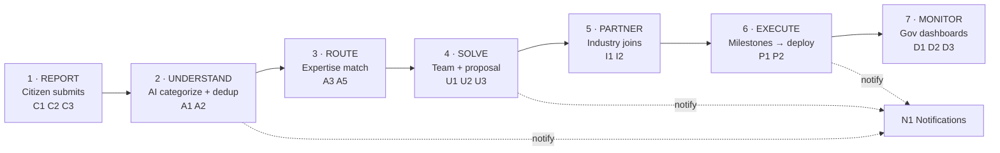

# 00 · MASTER PLAN — Societal Innovation Portal (SIH26043)

> **Single source of truth.** Every team member and every AI tool reads this folder before writing code.
> If a decision isn't written here, it isn't decided — raise it, don't improvise.

- **Problem Statement:** SIH26043 — *A digital platform to crowdsource societal challenges and facilitate collaborative problem-solving through universities and industry partnerships*
- **Sponsor:** Government of Jharkhand · Department of Higher & Technical Education
- **Sponsor lens (our edge):** This is **NOT** a grievance/complaint app. It is a *"turn community problems into university innovation projects"* engine, built around **NEP 2020** (real-world learning + industry collaboration).
- **Team:** 6 members, all AI-assisted developers, dividing by **vertical feature slices**.
- **Timeline:** **1 week (7 days)** to demo-ready.
- **Codebase:** Single **Turborepo monorepo** in the GitHub org.

---

## 1. The 3 features that win this PS (build these DEEP)

Everyone else will build a pretty complaint form and stop. We win on the three things they skip:

| # | Feature | Owner | Why it wins |
|---|---------|-------|-------------|
| **W1** | **Deduplication + clustering** (A2) | AI Service (M3) | "Reported by 300 citizens" turns noise into priority. Visual, obvious, rare. |
| **W2** | **Expertise-matching** problem → right professor (A3) | AI Service (M3) | A water problem routes to the professor who *researches water*, not a dropdown. The hardest thing others won't do. |
| **W3** | **NEP-outcome government dashboard** (D1/D3) | Gov Dashboard (M6) | Patents, startups, participation — exactly what the sponsor (Dept. of Higher Ed) measures. |

**Rule of thumb:** A shallow version of all 7 modules loses. A *deep* version of W1, W2, W3 wins. Everything else can be simpler.

---

## 2. Full requirement inventory (MoSCoW — nothing left out)

Priority legend: **[MUST]** demo-critical · **[SHOULD]** add if Day 4–6 allows · **[COULD]** bonus points if time remains.
Owner = the member responsible (see [07-TASK-DIVISION](07-TASK-DIVISION.md)).

### Group C — Citizen problem submission
| ID | Requirement | Priority | Owner |
|----|-------------|----------|-------|
| C1 | Anyone submits a problem via easy web + mobile (PWA) form | **MUST** | M2 |
| C2 | Attach photo/video/docs + map location + GPS auto-fill | **MUST** | M2 |
| C3 | Local languages (Hindi + tribal) + voice-to-text (Bhashini) | **SHOULD** | M2 |
| C4 | Citizen tracks their submitted problem (status timeline) | **SHOULD** | M2 |

### Group A — AI problem management (the smart core)
| ID | Requirement | Priority | Owner |
|----|-------------|----------|-------|
| A1 | Auto-categorize each problem into a topic | **MUST** | M3 |
| A2 | **Find + merge duplicates (dedup + clustering)** — *winning* | **MUST** | M3 |
| A3 | **Expertise-match problem → right university/professor** — *winning* | **MUST** | M3 |
| A4 | Prioritize problems by importance (score) | **COULD** | M3 |
| A5 | Validate before routing (spam/quality check) | **SHOULD** | M3 |

### Group U — University collaboration
| ID | Requirement | Priority | Owner |
|----|-------------|----------|-------|
| U1 | University sees problems matched to them (queue) | **MUST** | M4 |
| U2 | Form student+faculty team, assign a mentor | **MUST** | M4 |
| U3 | Submit a solution proposal / research project | **MUST** | M4 |
| U4 | Manage project workflow inside university (task board) | **SHOULD** | M4 |

### Group I — Industry & startup partnership
| ID | Requirement | Priority | Owner |
|----|-------------|----------|-------|
| I1 | Industry/startup/MSME/CSR register + browse open projects | **SHOULD** | M5 |
| I2 | Match companies to projects they can help (reuse A3 engine) | **SHOULD** | M5 |
| I3 | Track mentoring, funding, prototyping, pilots, tech-transfer | **COULD** | M5 |

### Group P — Project lifecycle management
| ID | Requirement | Priority | Owner |
|----|-------------|----------|-------|
| P1 | Track project idea → deployment (milestones, docs) | **SHOULD** | M5 |
| P2 | Record outcomes — patents, startups, IP | **COULD** | M5 |

### Group D — Government analytics dashboard
| ID | Requirement | Priority | Owner |
|----|-------------|----------|-------|
| D1 | Real-time numbers (problems, districts, topics, solved) | **MUST** | M6 |
| D2 | Jharkhand district map heatmap | **SHOULD** | M6 |
| D3 | **NEP impact — participation, patents, startups, completion** | **MUST** | M6 |

### Group N — Notifications & communication
| ID | Requirement | Priority | Owner |
|----|-------------|----------|-------|
| N1 | In-app + email notifications on key events | **SHOULD** | M5 |
| N2 | Per-project comment/chat thread | **COULD** | M5 |

### Group X — Cross-cutting (apply everywhere)
| ID | Requirement | Priority | Owner |
|----|-------------|----------|-------|
| X1 | 5 user roles with RBAC (Citizen, University, Industry, Gov, Admin) | **MUST** | M1 |
| X2 | Responsive + installable (PWA) | **MUST** | M1 |
| X3 | Transparent + scalable (clean DB, public status) | **SHOULD** | M1 |
| X4 | Reliable, crash-proof demo (seed data + Ollama fallback) | **MUST** | M1+M6 |

---

## 3. End-to-end lifecycle (the flow must connect start → finish)

If any stage doesn't connect to the next, the demo breaks. **Stage integration is owned by M1 and verified on Day 5.**

---

## 4. The 7-day plan at a glance

| Day | Theme | Exit criterion (must be true by end of day) |
|-----|-------|---------------------------------------------|
| **1** | **Walking skeleton** | Monorepo deploys; login works for all 5 roles; DB migrated; AI service `/health` green; every module has a stub page reading the shared API. |
| **2** | **Citizen → AI** | A citizen can submit a problem with photo+map; it gets categorized + embedded; it appears in DB. |
| **3** | **Dedup + Match** | Duplicate reports cluster ("reported by N"); problem routes to the correct university/professor. |
| **4** | **University → Project** | University forms a team, submits a proposal; project + milestones exist; outcomes recordable. |
| **5** | **Integrate everything** | Full lifecycle 1→7 runs end-to-end for one seeded story. Gov dashboard shows live numbers + map. |
| **6** | **Seed + harden** | Realistic Jharkhand seed data loaded; responsive/PWA verified; Ollama offline fallback tested; bugs fixed. |
| **7** | **Freeze + rehearse** | Code freeze; demo script rehearsed 3×; stable deploy live; backup video recorded. |

Full per-person breakdown: [07-TASK-DIVISION](07-TASK-DIVISION.md).

---

## 5. How 6 AI-assisted devs avoid integration hell (the "one hood")

The reason things break at the end is **drift**: two people's AIs invent two different shapes for the same thing. We kill drift with **shared contracts** that every AI tool is forced to import instead of reinvent:

1. **One database schema** — [`contracts/schema.prisma`](../contracts/schema.prisma). Nobody invents tables/fields. Changes go through M1.
2. **One set of types** — [`packages/types`](../contracts/types.ts). Every API request/response uses these. No ad-hoc interfaces.
3. **One API contract** — [03-API-CONTRACT](03-API-CONTRACT.md). Frontend codes against it *before* the backend exists (using mocks).
4. **One AI-service contract** — [04-AI-SERVICE](04-AI-SERVICE.md). Fixed request/response JSON.
5. **One design system** — [06-DESIGN-SYSTEM](06-DESIGN-SYSTEM.md). Everyone uses the same shadcn/ui components + tokens, so 6 people's screens look like one product.
6. **One rulebook for the AIs** — [`CLAUDE.md`](../CLAUDE.md). Committed to the repo root so every member's Claude Code / Cursor reads the same conventions.

**Golden rule:** *If your AI wants to create a new type, endpoint shape, table, or color — stop. Import the existing one. If it truly doesn't exist, add it to the contract and tell the team in the channel.*

---

## 6. Document index

| Doc | What it locks down | Read before you touch |
|-----|--------------------|-----------------------|
| [00-MASTER-PLAN](00-MASTER-PLAN.md) | Scope, priorities, timeline | anything |
| [01-ARCHITECTURE-AND-STACK](01-ARCHITECTURE-AND-STACK.md) | System diagram, locked stack, repo layout | writing any code |
| [02-DATA-MODEL](02-DATA-MODEL.md) | Entities, ER diagram, enums | any DB work |
| [03-API-CONTRACT](03-API-CONTRACT.md) | Every REST endpoint | any frontend/backend |
| [04-AI-SERVICE](04-AI-SERVICE.md) | Python service endpoints + models | AI module |
| [05-USER-FLOWS](05-USER-FLOWS.md) | Per-role journeys + sequence diagrams | any UI |
| [06-DESIGN-SYSTEM](06-DESIGN-SYSTEM.md) | Colors, type, components, Figma mapping | any UI |
| [07-TASK-DIVISION](07-TASK-DIVISION.md) | Who owns what, day-by-day | day 1 |
| [08-DEMO-SCRIPT](08-DEMO-SCRIPT.md) | The crash-proof demo narrative | day 6–7 |
| [`CLAUDE.md`](../CLAUDE.md) | AI coding rules (root) | every AI session |
