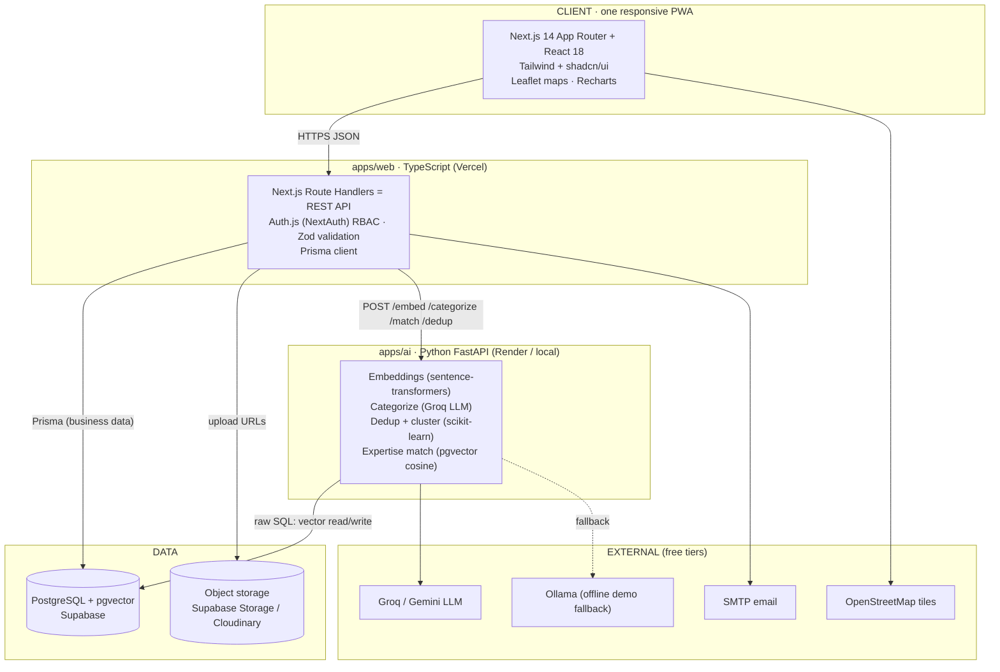

# 01 · ARCHITECTURE & TECH STACK

> This file is **locked**. Do not swap a library or version without M1's approval in the team channel.
> The whole point is that all 6 AIs generate code against the *same* stack.

---

## 1. System architecture (high level)



**Two apps, one database.** `apps/web` (TypeScript) owns all business data via Prisma. `apps/ai` (Python) owns all **vector** operations and talks to the same Postgres with raw SQL (because Prisma handles `vector` columns poorly). They never touch each other's tables' business logic — the boundary is the JSON contract in [04-AI-SERVICE](04-AI-SERVICE.md).

---

## 2. Locked tech stack (exact versions)

### 2.1 Monorepo & tooling
| Concern | Choice | Version | Notes |
|---------|--------|---------|-------|
| Package manager | **pnpm** | 9.x | Workspaces. `npm`/`yarn` are banned to avoid lockfile chaos. |
| Monorepo | **Turborepo** | 2.x | Task orchestration + caching for JS/TS apps. |
| Node | **Node** | 20 LTS | Everyone uses the same. |
| Language | **TypeScript** | 5.4+ | `strict: true` everywhere. |
| Lint/format | **ESLint + Prettier** | shared config in `packages/config` | One config, no per-app overrides. |

### 2.2 Frontend + Backend — `apps/web` **[MUST]**
| Concern | Choice | Notes |
|---------|--------|-------|
| Framework | **Next.js 14 (App Router)** | Full-stack: UI **and** REST API (Route Handlers under `app/api/`). One deployable, no CORS. |
| UI runtime | **React 18** | Server Components by default; Client Components where interactive. |
| Styling | **Tailwind CSS 3.4** | Utility-first. Tokens from design system only. |
| Components | **shadcn/ui** | The shared component library — *everyone uses these*, so 6 people's UI looks like one product. |
| Icons | **lucide-react** | Single icon set. |
| Data fetching | **TanStack Query v5** | All server-state on the client. No raw `useEffect` fetch. |
| Forms | **react-hook-form + Zod** | Zod schemas come from `packages/types`. |
| Validation | **Zod** | Same schemas validate API input server-side and forms client-side. |
| Auth | **Auth.js / NextAuth v4** | Credentials provider + JWT sessions carrying `role`. (v4 chosen for stable, well-documented AI codegen.) |
| ORM | **Prisma 5** | Single schema in `packages/db`. |
| Maps | **Leaflet + react-leaflet + OpenStreetMap** | Free. District GeoJSON for heatmap. |
| Charts | **Recharts** | Gov dashboard. |
| PWA | **next-pwa** (or manual manifest + SW) | Installable, offline shell. |
| State (UI only) | **Zustand** *(only if needed)* | Server-state → React Query; keep global UI state tiny. |

### 2.3 AI service — `apps/ai` **[MUST]**
| Concern | Choice | Notes |
|---------|--------|-------|
| Framework | **FastAPI** + **uvicorn** | Python 3.11. |
| Embeddings | **sentence-transformers** `all-MiniLM-L6-v2` | 384-dim, free, runs locally, no API cost. |
| LLM (categorize/validate) | **Groq** (Llama 3.1) primary, **Gemini** backup, **Ollama** offline fallback | Configurable via env. |
| Clustering | **scikit-learn** (cosine + threshold / DBSCAN) + **numpy** | Dedup grouping. |
| DB access | **asyncpg** / **psycopg** + **pgvector** | Raw SQL for vector columns. |
| Schema validation | **Pydantic v2** | Request/response models mirror [04-AI-SERVICE](04-AI-SERVICE.md). |

### 2.4 Data & infra
| Concern | Choice | Free tier | Notes |
|---------|--------|-----------|-------|
| Database | **PostgreSQL 15 + pgvector** via **Supabase** | ✅ | One DB for business + vector data. |
| File storage | **Supabase Storage** (S3-compatible) | ✅ | Photos/videos/docs. Cloudinary is the approved fallback. |
| Web hosting | **Vercel** | ✅ | Deploys `apps/web`. |
| AI hosting | **Render** (or **HF Spaces**) | ✅ | Deploys `apps/ai`. **For the live demo, also run `apps/ai` locally** to avoid cold starts. |
| Email | **SMTP** (Gmail app password / Resend free) | ✅ | Notifications. SMS/WhatsApp cost money → skip. |
| Language/voice | **Bhashini** | ✅ | Hindi + tribal voice-to-text/translation (SHOULD). |

> **Cost = ₹0.** Every choice above has a free tier. This is a stated requirement of the PS.

---

## 3. Monorepo layout (the repo skeleton)

```
societal-innovation-portal/            (GitHub org root repo)
├─ apps/
│  ├─ web/                     # Next.js 14 — UI + REST API  [M1 scaffolds, all own their module]
│  │  ├─ app/
│  │  │  ├─ (public)/          # landing, login, register
│  │  │  ├─ citizen/           # C1–C4        [M2]
│  │  │  ├─ university/        # U1–U4        [M4]
│  │  │  ├─ industry/          # I1–I3        [M5]
│  │  │  ├─ gov/               # D1–D3        [M6]
│  │  │  ├─ project/           # P1–P2, N2    [M5]
│  │  │  └─ api/               # Route Handlers = REST endpoints (see 03)
│  │  │     ├─ auth/           # NextAuth     [M1]
│  │  │     ├─ problems/       # [M2/M4]
│  │  │     ├─ clusters/       # [M3 integration]
│  │  │     ├─ universities/   # [M4]
│  │  │     ├─ teams/ proposals/ projects/   # [M4/M5]
│  │  │     ├─ industry/ partnerships/       # [M5]
│  │  │     ├─ analytics/      # [M6]
│  │  │     └─ notifications/  # [M5]
│  │  ├─ components/           # app-specific components (compose packages/ui)
│  │  ├─ lib/                  # auth helpers, ai-client, prisma re-export
│  │  └─ public/               # manifest.json, icons, district GeoJSON
│  └─ ai/                      # Python FastAPI            [M3]
│     ├─ app/
│     │  ├─ main.py            # FastAPI app + routes
│     │  ├─ embeddings.py
│     │  ├─ categorize.py
│     │  ├─ dedup.py
│     │  ├─ matching.py
│     │  └─ db.py              # asyncpg + pgvector
│     ├─ requirements.txt
│     └─ Dockerfile
├─ packages/
│  ├─ db/                      # Prisma schema + client    [M1]
│  │  ├─ prisma/schema.prisma  # == contracts/schema.prisma (source of truth)
│  │  ├─ prisma/seed.ts        # seed data                 [M1/M6]
│  │  └─ index.ts              # exports singleton PrismaClient
│  ├─ types/                   # shared Zod schemas + TS types  [M1]
│  │  └─ index.ts              # == contracts/types.ts
│  ├─ ui/                      # shadcn/ui components + tokens  [M1]
│  └─ config/                  # eslint, tsconfig, tailwind preset  [M1]
├─ contracts/                  # human-readable copies (this planning bundle)
├─ docs/                       # this documentation
├─ CLAUDE.md                   # AI rules (root)           [M1]
├─ .env.example
├─ turbo.json
├─ pnpm-workspace.yaml
└─ package.json
```

### Import boundaries (enforced by convention + ESLint)
- `apps/web` imports from `@repo/db`, `@repo/types`, `@repo/ui`, `@repo/config`.
- `apps/web` calls `apps/ai` **only** through `apps/web/lib/ai-client.ts` (typed wrapper). No scattered `fetch` to the AI service.
- `apps/ai` reads/writes **only** the `embedding` vector columns + reads the rows it needs. It never implements business rules that belong in `apps/web`.
- Nothing imports across `apps/web/app/<module>` boundaries except through shared `packages/*`. Modules talk via the DB + API, not by reaching into each other's folders.

---

## 4. Environments & config

| Env | web | ai | db |
|-----|-----|-----|-----|
| **local** | `pnpm dev` → localhost:3000 | `uvicorn` → localhost:8000 | Supabase (shared cloud) or local Postgres+pgvector via Docker |
| **preview** | Vercel PR preview | Render preview | Supabase |
| **demo** | Vercel prod | **local uvicorn** (reliable) + Render backup | Supabase (pre-seeded) |

All secrets via env vars — see [`.env.example`](../.env.example). **Never commit `.env`.**

---

## 5. Why these choices (defend them to judges)
- **Monorepo + shared contracts** → 6 AI-assisted devs can't drift apart; integration is compile-time-checked.
- **Next.js full-stack** → one language, one deployable for the whole web app; fastest path in 1 week.
- **Separate Python AI service** → the winning features (embeddings, clustering, matching) live where the ML ecosystem is strongest, owned by one person, cleanly bounded by JSON.
- **pgvector in the same Postgres** → no extra vector DB to run; matching + dedup + business data in one place.
- **All free tier** → satisfies the PS constraint and scales across the state later.
