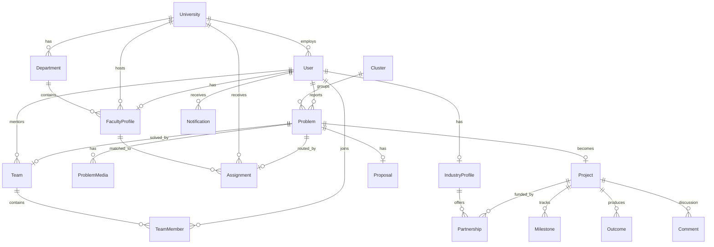
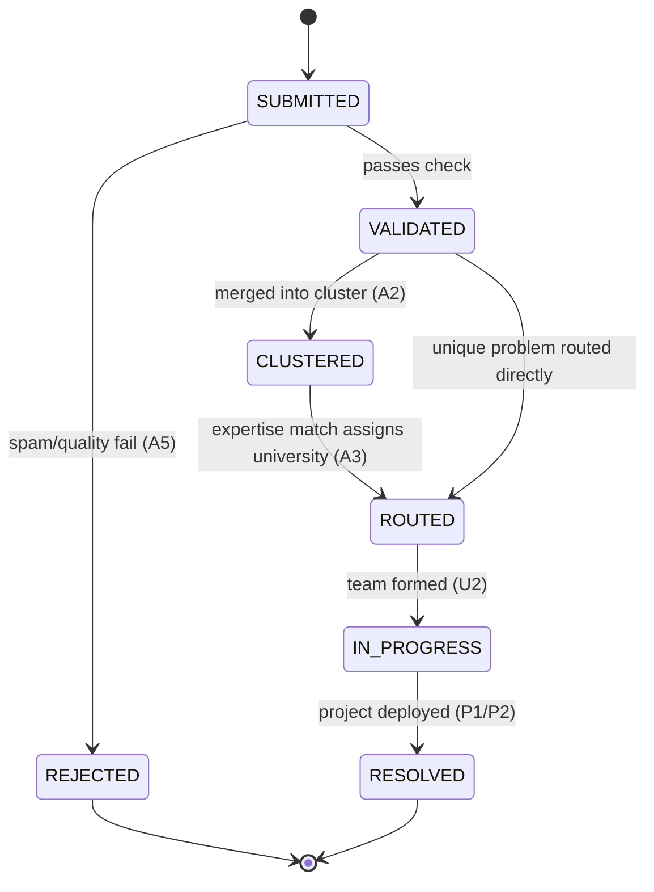

# 02 · DATA MODEL

> Source of truth: [`contracts/schema.prisma`](../contracts/schema.prisma) (== `packages/db/prisma/schema.prisma`).
> **Nobody invents tables or fields.** Need a new one? Propose it to M1, update the schema, migrate, announce it.

---

## 1. Entity-relationship diagram



---

## 2. The lifecycle expressed as data

One citizen report becomes one row in each table as it travels the pipeline:

```
Problem(status=SUBMITTED)
  → +embedding, category set        (A1, A2)      status=VALIDATED/CLUSTERED, clusterId set
  → +Assignment(universityId,facultyId,matchScore)  (A3)  status=ROUTED
  → +Team(+TeamMember, mentor)      (U2)          status=IN_PROGRESS
  → +Proposal(status=SUBMITTED→APPROVED)          (U3)
  → +Project(status=PLANNING→…→DEPLOYED)          (P1)
  → +Partnership(s)                 (I1–I3)
  → +Outcome(PATENT/STARTUP/…)      (P2)           Problem.status=RESOLVED
```

`Problem` is the spine. Every module attaches its rows to a `Problem` (or the `Project` derived from it). This is why cross-module integration is trivial: **everyone hangs off the same spine via foreign keys defined in the shared schema.**

---

## 3. Vector columns (pgvector) — the AI service's territory

Prisma cannot model `vector(384)` cleanly, so these columns are added by a **raw SQL migration** and owned entirely by `apps/ai`. Run once after `prisma migrate`:

```sql
-- packages/db/prisma/migrations/manual_vectors.sql   (M1 runs; M3 depends on it)
CREATE EXTENSION IF NOT EXISTS vector;

ALTER TABLE "Problem"          ADD COLUMN IF NOT EXISTS embedding vector(384);
ALTER TABLE "FacultyProfile"   ADD COLUMN IF NOT EXISTS "expertiseEmbedding" vector(384);
ALTER TABLE "Cluster"          ADD COLUMN IF NOT EXISTS centroid vector(384);
ALTER TABLE "IndustryProfile"  ADD COLUMN IF NOT EXISTS "expertiseEmbedding" vector(384);

-- similarity indexes (cosine)
CREATE INDEX IF NOT EXISTS problem_embedding_idx
  ON "Problem" USING ivfflat (embedding vector_cosine_ops) WITH (lists = 100);
CREATE INDEX IF NOT EXISTS faculty_expertise_idx
  ON "FacultyProfile" USING ivfflat ("expertiseEmbedding" vector_cosine_ops) WITH (lists = 100);
```

- **Embedding model:** `all-MiniLM-L6-v2` → **384 dimensions** (fixed — do not change, or every stored vector breaks).
- **Who writes them:** `apps/ai` only, via `asyncpg`/`psycopg`.
- **Who reads them for similarity:** `apps/ai` only (cosine queries). `apps/web` never selects the vector columns.

Example similarity query the AI service runs (A3 — expertise match):
```sql
SELECT id, "userId", "universityId",
       1 - ("expertiseEmbedding" <=> $1) AS score
FROM "FacultyProfile"
WHERE "expertiseEmbedding" IS NOT NULL
ORDER BY "expertiseEmbedding" <=> $1   -- <=> is cosine distance
LIMIT 5;
```

---

## 4. Enum reference (use these exact strings everywhere)

| Enum | Values |
|------|--------|
| `Role` | CITIZEN · STUDENT · FACULTY · UNIVERSITY_ADMIN · INDUSTRY · GOVERNMENT · ADMIN |
| `Category` | EDUCATION · HEALTH · WATER · AGRICULTURE · ENVIRONMENT · ENERGY · URBAN · ACCESSIBILITY · GOVERNANCE · RURAL_LIVELIHOOD · SANITATION · INFRASTRUCTURE · OTHER |
| `ProblemStatus` | SUBMITTED · VALIDATED · CLUSTERED · ROUTED · IN_PROGRESS · RESOLVED · REJECTED |
| `Severity` | LOW · MEDIUM · HIGH · CRITICAL |
| `ProposalStatus` | DRAFT · SUBMITTED · APPROVED · REJECTED |
| `ProjectStatus` | PLANNING · IN_EXECUTION · PILOT · DEPLOYED · CLOSED |
| `MilestoneStatus` | TODO · IN_PROGRESS · DONE · BLOCKED |
| `PartnerOffering` | FUNDING · MENTORING · PROTOTYPING · PILOT · TECH_TRANSFER |
| `OutcomeType` | PATENT · STARTUP · IP_TRANSFER · PUBLICATION · DEPLOYMENT |
| `NotificationType` | PROBLEM_SUBMITTED · PROBLEM_ROUTED · TEAM_FORMED · PROPOSAL_SUBMITTED · PROPOSAL_REVIEWED · PARTNER_JOINED · MILESTONE_UPDATED · OUTCOME_RECORDED · GENERIC |

These enum strings are duplicated as Zod enums in [`packages/types`](../contracts/types.ts) — the client and API validate against the same list.

---

## 5. Problem status state machine



**Only the owning module may transition status.** M2 owns SUBMITTED→VALIDATED/REJECTED (with M3's check). M3 owns →CLUSTERED/ROUTED. M4 owns →IN_PROGRESS. M5 owns →RESOLVED. Document the transition in the PR.

---

## 6. Seed data plan (credibility of the demo) **[MUST]**

Owned by M1 (script) + M6 (content realism). Lives in `packages/db/prisma/seed.ts`.

- **Universities (real):** BIT Mesra, NIT Jamshedpur, IIT-ISM Dhanbad, Ranchi University, Central University of Jharkhand — with real departments + plausible faculty research areas (for credible matching).
- **Faculty (~20):** each with 3–5 `researchAreas` spanning water, agriculture, energy, health, education, etc. Embeddings generated by `apps/ai` on seed.
- **Citizen problems (~60):** across all 24 Jharkhand districts and all categories. **Deliberately include duplicates** (e.g. 8 near-identical "broken water pipeline in Ranchi" reports) so clustering visibly fires.
- **Industry partners (~5):** a solar startup, an agri-firm, an IT MSME, a CSR foundation, a research lab — each with `offerings` + sector for matching.
- **A few completed projects** with `Outcome` rows (1–2 patents, 1 startup) so the NEP dashboard isn't empty.

> After `seed.ts` inserts rows, a one-shot script calls `apps/ai` `/embed` for every problem + faculty + industry profile to populate the vector columns.
