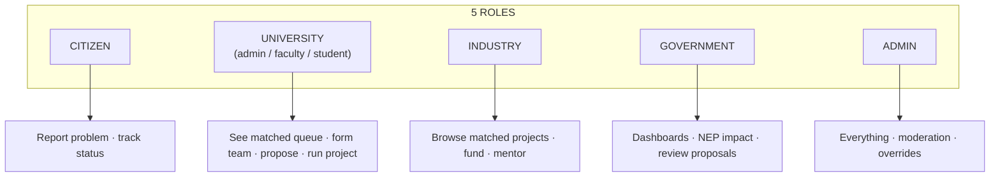
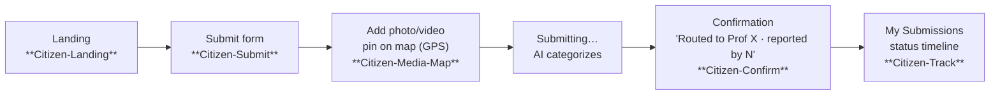
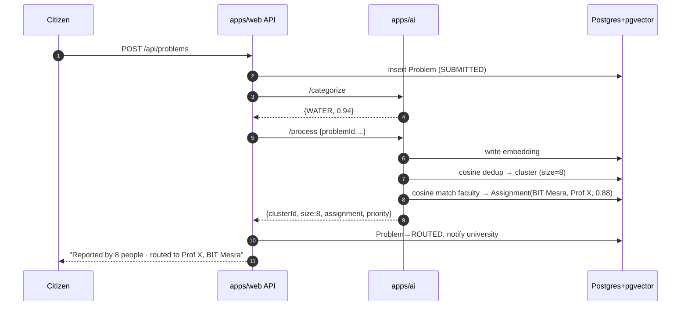
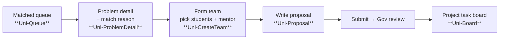
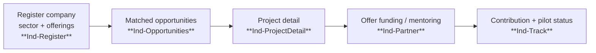
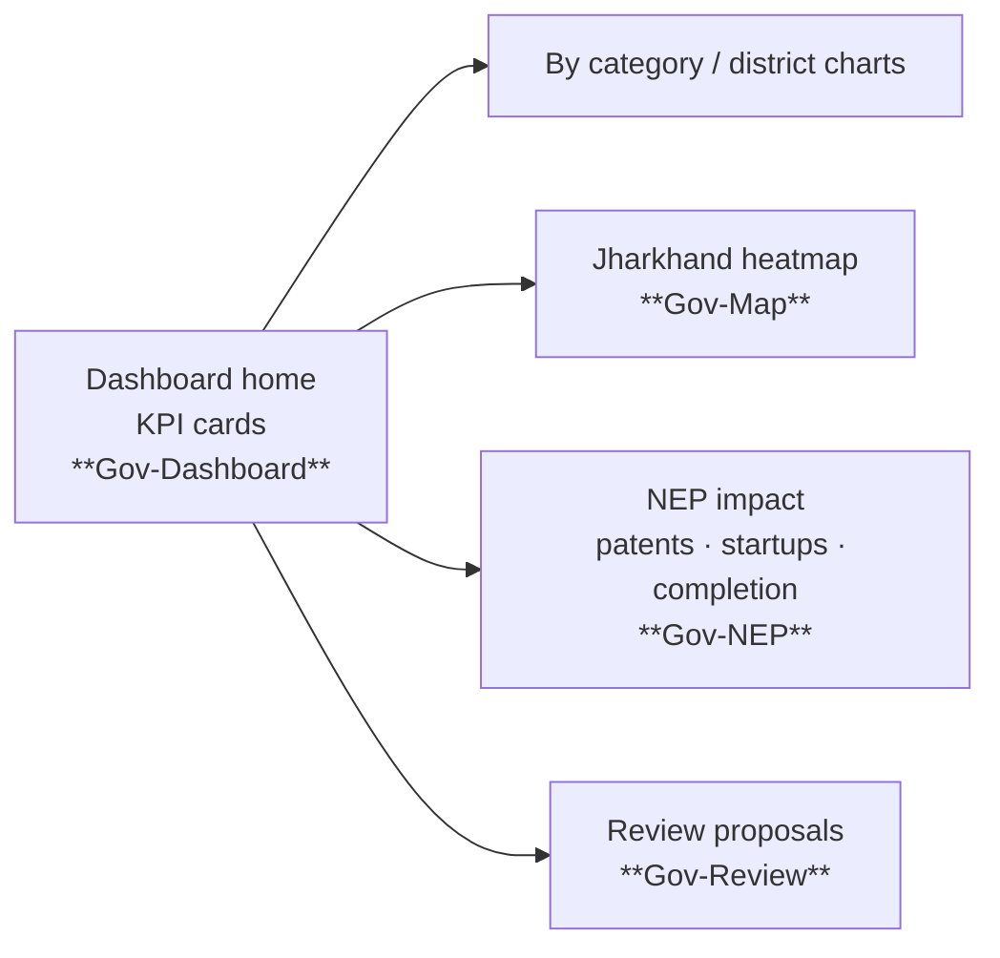
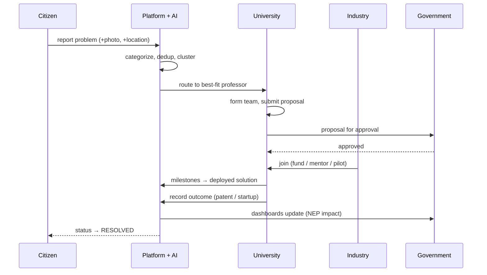

# 05 · USER FLOWS & JOURNEYS

> Diagrams render on GitHub and in the handbook artifact. Build screens to match these flows.
> These are also the blueprint for the **Figma** screens (frame names in **bold** below).

---

## 1. Roles → what they can do (RBAC map) **[MUST · X1]**

Each role lands on its own home after login: `/citizen`, `/university`, `/industry`, `/gov`, `/admin`. `requireRole()` guards both pages and API.

---

## 2. Citizen journey (C1–C4) · Owner M2

Key UX rules: big fields, minimal steps, works one-handed on mobile, Hindi toggle (C3), optional voice input (Bhashini). GPS auto-fills lat/long; map pin is adjustable.

---

## 3. The core AI pipeline (what happens after submit) · Owner M3

This sequence is the money shot of the demo — dedup ("reported by 8") and expertise-match ("Prof X who researches water") happen visibly.

---

## 4. University journey (U1–U4) · Owner M4

The queue only shows problems whose `Assignment.universityId` = this university (that's why matching must run first).

---

## 5. Industry journey (I1–I3) · Owner M5

Opportunities are matched with the **same engine as A3** (`/match/industry`), so a solar startup sees energy projects.

---

## 6. Government journey (D1–D3) · Owner M6

Every number is a live DB aggregation. NEP panel is what the sponsor cares about — give it prominence.

---

## 7. Full lifecycle swimlane (how all roles connect) **[MUST]**

If you can drive this one sequence end-to-end with seeded data on Day 5, the product is demo-complete.

---

## 8. Figma organization (so all screens match) **[SHOULD]**
- **Pages:** `00 Design System` · `01 Citizen` · `02 University` · `03 Industry` · `04 Government` · `05 Auth/Shared` · `06 Flows (FigJam)`.
- Frame names above (**bold**) are the canonical screen names — use them in Figma and as the React route/page name so design ↔ code map 1:1.
- Build the shared components (button, input, card, badge, table, chart shell) on the `00 Design System` page first; every other page composes them. This is the visual equivalent of `packages/ui`.
- Tokens (colors/type/spacing) come from [06-DESIGN-SYSTEM](06-DESIGN-SYSTEM.md) and must be defined as Figma variables so a color change propagates everywhere.
