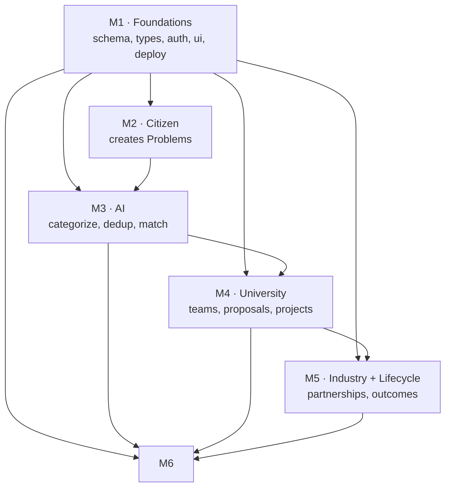

# 07 · TASK DIVISION & 7-DAY PLAN

> 6 members, all AI-assisted, dividing by **vertical feature slice**. Each owns their module's pages
> **and** API routes **and** DB usage — full stack for their slice. Shared contracts keep it all compatible.
> Priority tags: **[MUST]** · **[SHOULD]** · **[COULD]**.

---

## 1. Ownership map

| Member | Slice | Owns | Requirements |
|--------|-------|------|--------------|
| **M1** | **Platform & Foundations** (enabler) | Monorepo, shared packages (`db`,`types`,`ui`,`config`), Auth+RBAC, `AppShell`, seed script, deploy pipeline, `CLAUDE.md` | X1, X2, X3, X4, auth for all |
| **M2** | **Citizen** | `/citizen/*` + `/api/problems/*`, media upload, map, geolocation, tracking, i18n | C1, C2, C3, C4 |
| **M3** | **AI Service** (enabler) | `apps/ai` entirely + vector columns + `lib/ai-client.ts` | A1, A2, A3, A4, A5, I2 engine |
| **M4** | **University** | `/university/*` + `/api/teams,proposals`, routing queue UI | U1, U2, U3, U4 |
| **M5** | **Industry + Lifecycle** | `/industry/*`, `/project/*` + `/api/industry,partnerships,projects,notifications` | I1, I2(UI), I3, P1, P2, N1, N2 |
| **M6** | **Government + Data Viz** | `/gov/*` + `/api/analytics/*`, charts, map, NEP panel, demo script | D1, D2, D3, X4(demo) |

**Enablers (M1, M3) front-load on Day 1** so the other four are never blocked.

---

## 2. Dependency graph (who waits on whom)

The only hard blockers are **M1 on Day 1** (everyone needs the skeleton) and **M3's `/process`** (M4's queue needs routed problems). Everyone else works against **mocks** until the real contract lands, then swaps — because both sides use `@repo/types`, the swap just compiles.

---

## 3. Day-by-day (each cell tagged by priority)

### DAY 1 — Walking skeleton 🦴 (everyone unblocked by tonight)
| M1 | M2 | M3 | M4 | M5 | M6 |
|----|----|----|----|----|----|
| **[MUST]** init Turborepo + pnpm workspace; `packages/db,types,ui,config`; Prisma migrate; vector SQL; NextAuth+RBAC; `AppShell` + role routing; Vercel+Supabase+Render wired; commit `CLAUDE.md` | **[MUST]** `/citizen` shell + submit form UI against mock `POST /api/problems` | **[MUST]** FastAPI skeleton; load MiniLM; `/health`, `/embed`; connect asyncpg to Supabase | **[MUST]** `/university` shell + queue UI against mock `/api/assignments` | **[MUST]** `/industry` + `/project` shells against mocks | **[MUST]** `/gov` dashboard shell + `StatCard`s + Recharts against mock analytics |
| **Exit:** repo builds & deploys; login as each role reaches its home. | | | | | |

### DAY 2 — Citizen → AI live
| M1 | M2 | M3 | M4 | M5 | M6 |
|----|----|----|----|----|----|
| **[MUST]** finalize `ai-client.ts` wrapper + `requireRole`; seed script v1 (universities+faculty) | **[MUST]** real `POST /api/problems` → DB; media signed-upload (C2); map pin + GPS | **[MUST]** `/categorize` (A1) + `/process` embed→store vector (A2 part) | **[MUST]** real `GET /api/assignments` reading DB (stub matches ok) | **[SHOULD]** industry register (I1) + project model API | **[MUST]** real `/api/analytics/summary,by-category` (D1) |
| **Exit:** citizen submits a real problem; it's categorized + embedded in DB. | | | | | |

### DAY 3 — Dedup + Match (the winning day) 🏆
| M1 | M2 | M3 | M4 | M5 | M6 |
|----|----|----|----|----|----|
| **[SHOULD]** notifications infra (N1) shared helper | **[SHOULD]** "my submissions" tracking (C4) + cluster badge on confirm | **[MUST]** dedup/cluster (A2) + expertise-match→Assignment (A3); `/match/university` | **[MUST]** queue shows real matched problems + match reason; form team (U2) | **[SHOULD]** `/match/industry` UI (I2) opportunities list | **[MUST]** by-district (D2 data) + `ClusterBadge` in analytics |
| **Exit:** duplicates cluster ("reported by N"); problems route to correct professor. | | | | | |

### DAY 4 — University → Project → Outcomes
| M1 | M2 | M3 | M4 | M5 | M6 |
|----|----|----|----|----|----|
| **[SHOULD]** seed v2 (60 problems w/ dupes, industry, outcomes) + embed backfill | **[SHOULD]** Hindi i18n toggle + voice input (C3) | **[SHOULD]** `/validate` (A5) + `/priority` (A4); tune threshold on seed | **[MUST]** proposal submit + review (U3); task board (U4) | **[SHOULD]** partnerships + funding (I3); project milestones (P1); outcomes (P2) | **[MUST]** NEP impact panel (D3) + map heatmap (D2) |
| **Exit:** university proposes → gov approves → project + outcomes exist. | | | | | |

### DAY 5 — Integration day 🔗 (M1 leads; all pair up)
- **[MUST]** Drive the **full lifecycle** (report → … → resolved) on seed data, end to end.
- **[MUST]** Wire notifications on each transition (N1). Fix every broken hand-off between modules.
- **[MUST]** Gov dashboard reflects the seeded story: real counts, map lit, NEP numbers non-zero.
- **[SHOULD]** per-project comments (N2). **Exit:** one seeded story flows 1→7 without a manual DB edit.

### DAY 6 — Seed realism + harden
- **[MUST]** Load credible Jharkhand seed (real universities/faculty; dupes that cluster visibly).
- **[MUST]** Responsive pass + PWA installable (X2); test on a phone.
- **[MUST]** Ollama offline fallback tested (X4); AI-down graceful degrade tested.
- **[SHOULD]** empty/loading/error states everywhere; a11y pass. **Exit:** demo runs offline-safe.

### DAY 7 — Freeze + rehearse
- **[MUST]** Code freeze at midday. Only bug fixes after.
- **[MUST]** Rehearse [08-DEMO-SCRIPT](08-DEMO-SCRIPT.md) 3×; time it; assign speaking parts.
- **[MUST]** Stable prod deploy + **record a backup screen video** (if live fails, play the video).
- **[SHOULD]** Prepare 3 judge Q&A answers (dedup, matching, NEP). **Exit:** rehearsed, deployed, backed up.

---

## 4. Definition of Done (every feature, before "it works")
1. Uses `@repo/types` shapes — no ad-hoc interfaces.
2. API returns the standard envelope; input Zod-validated; `requireRole` applied.
3. Handles loading + empty + error states in the UI.
4. Works on mobile width (375px) and desktop.
5. No hardcoded colors — design tokens only.
6. Seed data exercises it (so it's visible in the demo).
7. Merged to `main` via PR that names the requirement IDs (e.g. "C2, C4").

---

## 5. Git workflow (keeps 6 people out of each other's way)
- Branch per feature: `m2/citizen-submit`, `m3/dedup-cluster`. **Never commit straight to `main`.**
- Small PRs, reviewed by one other member. Merge often (at least end of each day) to avoid Day-7 merge hell.
- **Contract changes** (`schema.prisma`, `packages/types`, docs 02/03/04) require M1 review + a channel announcement — these ripple to everyone.
- Because modules live in separate folders, day-to-day PRs rarely conflict; conflicts mostly hit shared packages, which is exactly why M1 gatekeeps them.

---

## 6. Risk & fallback (so 1 week actually lands)
| Risk | Fallback |
|------|----------|
| AI service too slow / cold-start in demo | Run `apps/ai` locally; `SEED_MODE` deterministic matches |
| Matching quality looks weak | Curate faculty seed so seeded problems match cleanly; show top-3 with reasons |
| A member's slice slips | Its features are SHOULD/COULD — drop to the MUST core; lifecycle still closes |
| Integration breaks Day 7 | Day-5 integration + Day-7 backup video guarantee a showable demo |
| Real-time i18n/voice (C3) unstable | It's SHOULD — ship Hindi UI strings only, skip live voice |
